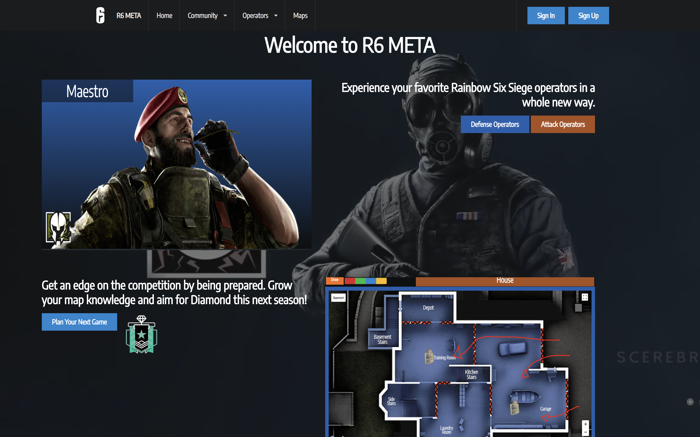
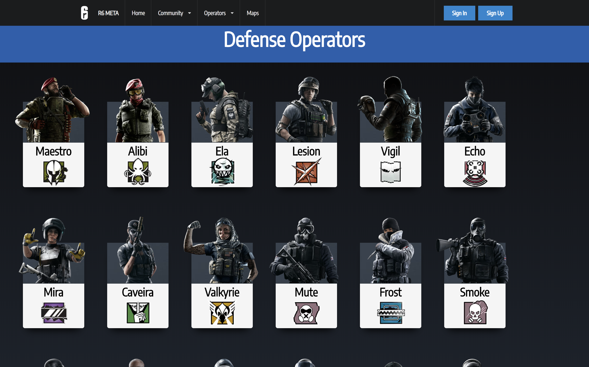
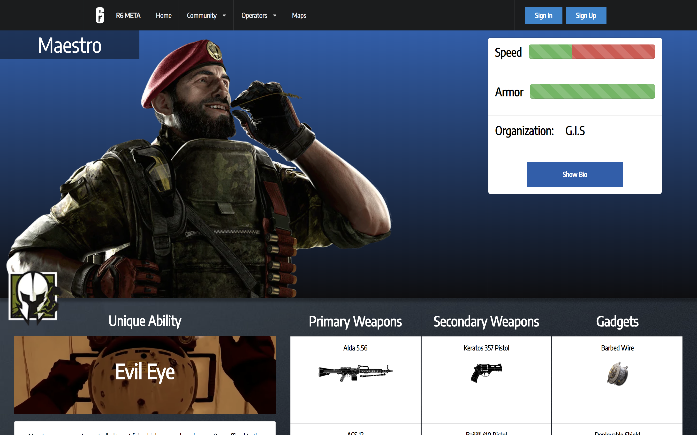
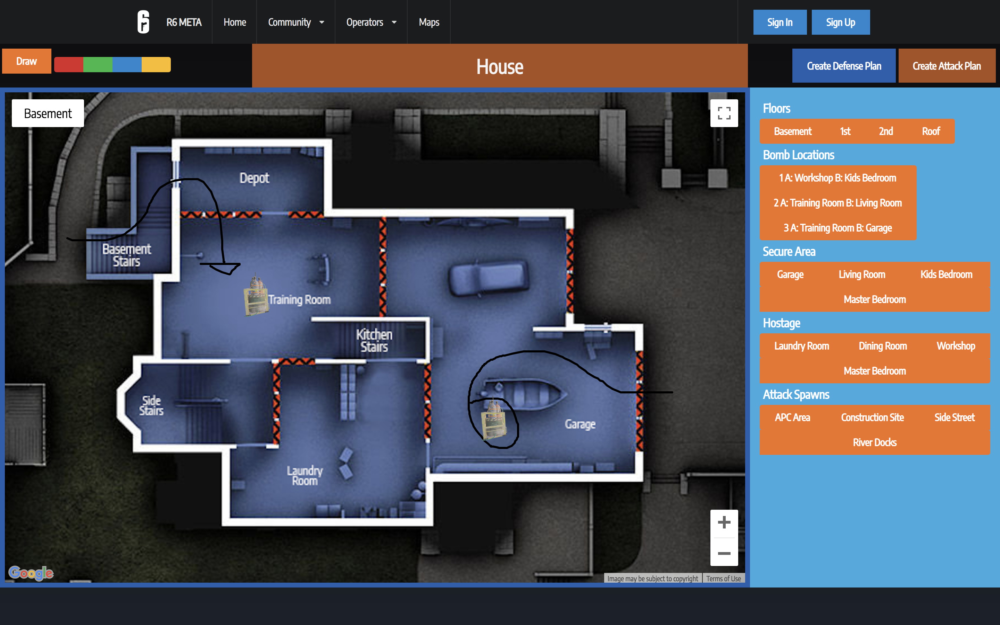

# Welcome to the React Site for R6 META. 

[](https://greenkeeper.io/)

* A site built for players to plan their next game and share with the community around them. 

<!-- [Link to project hosted]() -->

## Home Page



## Operator Selection Page Example



## Individual Operator Page Example



## Map Selection Page


## Map Planner example



## Technologies Used

* React
* AXIOS
* google maps api
* Express 
* Node
* API server located on github as well 
[API Location](https://github.com/DaltonHart/R6-Tactics)
* Semantic UI React
* Bootstrap React

## Project Planning

[Project Folder](https://drive.google.com/open?id=1XtcfO4-FAsR1xSGFzFRXLnW21xgaQUNq)


## Existing Features
* Operators are pulled from made api and the site genereates their character page based on the api information.
* Map information is pulled from api and created dynamically into a google map
* Users can navigate the map via several layers choosing what to view on the map
* Users can draw on the google map with turning it off and on via state update of a button


## Planned Features
* Users will be able to create an account via the ubisoft api login and then participate in forum discussion 
* Users will be able to save their created maps into "strats" and then get feedback on them from other players
* Users will be able to comment and create counter Strats 
* Users will be able to have a Community Section where they can share all their R6 creator content
* Mobile Adoption with touch support for the map editor throught react native


## Cool Code Snippets
How the Map works on saving state and updating to view floors. Due to limitations on React Maps regular maps was used. 

```javascript
//save img location as variable updated by current state
const floorimg = `http://localhost:8000${this.props.selectedFloor.img}`
//define map type as image map
        var MapType = new window.google.maps.ImageMapType({
            getTileUrl: function(coord, zoom) {
                var normalizedCoord = getNormalizedCoord(coord, zoom);
                if (!normalizedCoord) {
                  return null;
                }
//returning the image per section of the map via the bounded name (see image files for clerificaton)
                var bound = Math.pow(2, zoom);
                return floorimg +
                       zoom + '/tile_' + normalizedCoord.x + '_' +
                    (normalizedCoord.y) + '.png';
            },
//define tile size
            tileSize: new window.google.maps.Size(256, 256),
            maxZoom: 4,
            minZoom: 2,
            radius: 1738000,
            name: this.props.selectedFloor.name
          });
 //set map type       
          map.mapTypes.set(this.props.selectedFloor.name, MapType);
          map.setMapTypeId(this.props.selectedFloor.name);
//add listeners and update state of zoom and center point
          map.addListener('zoom_changed', () => {
            this.setState({
              zoom: map.getZoom(),
            });
          });
          
          map.addListener('center_changed', () => {
            this.setState({
              center: map.getCenter(),
            });

```
Progress bars dynamically generated for Ops
```javascript
//in render before return
    const SpeedRating = (this.props.defop.SpeedRating * 33) + 1
    const ArmorRating = (this.props.defop.ArmorRating * 33) + 1
//in return
    <ProgressBar>
    <ProgressBar striped bsStyle="success" now={SpeedRating} key={1} />
     <ProgressBar striped bsStyle="danger" now={100 - SpeedRating} key={2} />
    </ProgressBar>

```
Creating Individual Markers based on conditions that are updated via state changes. 
``` javascript
if(this.props.selectedAtk ===   this.props.map.atkspawns.atkspawn4){

    let marker1 = new window.google.maps.Marker({
        position: {lat: 18, lng: 80},
        map: map,
        title: '3A',
        icon: atkIcon,
                     });
              }

```


# Project Setup
* Clone down this repo. 
* Open Project in Terminal
```
$ npm install
```
* this will allow you to install all dependancies. (ensure your computer enviroment is setup to support running a react enviroment) 
```
$ npm start server
```